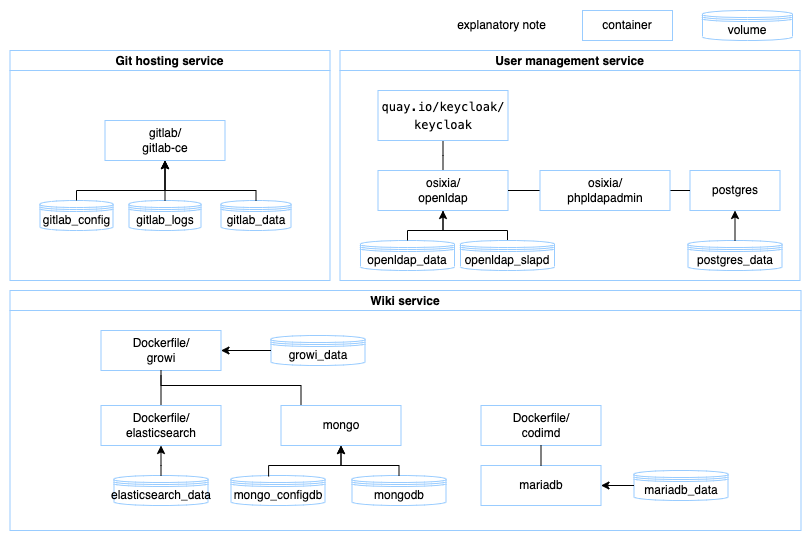
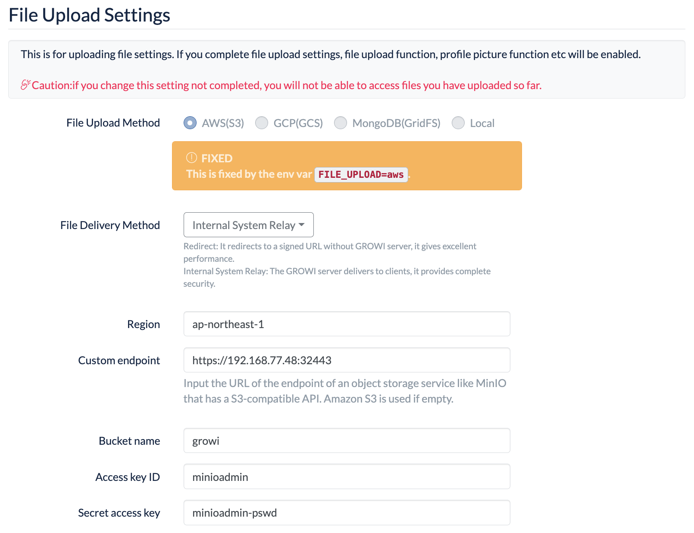

# Development environment with SSO

Compose file to launch GitLab and Growi with Keycloak on the local machine.  

***[note]***

- mainly for localhost.
- HTTP(non-tls).

## Components

- Git hosting service
    - GitLab
- Wiki service
    - Growi
- User management service
    - Keycloak

    

## Features

-  Keycloak

    - Open source identify provider.
    - See [keycloak.org](https://www.keycloak.org/) for the deteals.

- GitLab

    - Open source git hosting software.
    - See [gitlab.com](https://about.gitlab.com/) for the deteals.

- Growi

    - Open source wiki software.
    - Edit with markdown.
        - Edit table with spreadsheet-like UI.
        - Simultaneous update by multiple people with CodiMD.
        - Create image with draw.io editor.
            - Can import/export editable image.
    - See [growi.org](https://growi.org/ja/#features) for the deteals.

## Usage

1. Edit [env](.env) file.

    - Environment variable `_KEYCLOAK_GL_FP` for GitLab

        ```bash
        curl --silent http://192.168.77.48:20082/realms/local/protocol/saml/descriptor | sed -e 's/^.*<ds:X509Certificate>\(.*\)<\/ds:X509Certificate>.*$/\1/g' | printf -- "-----BEGIN CERTIFICATE-----\n%s\n-----END CERTIFICATE-----\n" $(cat) | openssl x509 -sha1 -fingerprint -noout | sed -e 's/^.*sha1 Fingerprint=\(.*\)/\1/g' | printf -- "\n_KEYCLOAK_GL_FP='%s'\n\n" $(cat)
        ```
    
    - Environment variable `_KEYCLOAK_WIKI_PEM` for Growi

        ```bash
        curl --silent http://192.168.77.48:20082/realms/local/protocol/saml/descriptor | sed -e 's/^.*<ds:X509Certificate>\(.*\)<\/ds:X509Certificate>.*$/\1/g' | printf -- "\n_KEYCLOAK_WIKI_PEM='%s'\n\n" $(cat)
        ```

2. Launch the containers.

    Execute the following command.

    ```bash
    docker-compose -f ./docker-compose.yaml -f ./docker-compose.gitlab.yaml -f ./docker-compose.growi.yaml -f ./docker-compose.minio.yaml up -d
    ```

    Wait a little until the following log is output.  
    Check log with `docker logs -f gitlab-ce` .

    ```plain
    ==> /var/log/gitlab/nginx/gitlab_error.log <==
    
    ==> /var/log/gitlab/nginx/access.log <==
    
    ==> /var/log/gitlab/nginx/current <==
    
    ==> /var/log/gitlab/nginx/gitlab_pages_error.log <==
    
    ==> /var/log/gitlab/nginx/error.log <==
    ```

    Check log with `docker logs -f growi` .

    ```plain
    [GROWI] Loading styles for HackMD is not processed because currently not in iframe
    [GROWI] Loading agent for HackMD is not processed because currently not in iframe
    ```

3. Configure the services.

    - ldap(before configuration keycloak)

        1. Create organization(add groups, users)

            ```bash
            docker exec -it openldap ldapmodify -Y EXTERNAL -H ldapi:/// -f /tmp/init.ldif
            ```

    -  keycloak(before launching dependent services)

        1. Add Realm

            |key|value|
            |---|---|
            |Name|`local`|

        2. Configuration Realm

            |section|key|value|
            |---|---|---|
            |Configire > Realm Settings > Login|Login with email|`OFF`|

        3. Add User federation

            |Section|key|value|
            |---|---|---|
            |Configure > User Federation|Add provider...|`ldap`|

            |Section|key|value|
            |---|---|---|
            |Required Settings|Import Users|`ON`|
            ||Edit Mode|`WRITABLE`|
            ||Sync Registrations|`ON`|
            ||Vendor|`Other`|
            ||Import Users|`ON`|
            ||RDN LDAP attribute|`cn`|
            ||Connection URL|`ldap://openldap`|
            ||Users DN|`ou=worker,dc=workspace,dc=local`|
            ||Search Scope|`Subtree`|
            ||Bind Type|`simple`|
            ||Bind DN|`cn=maintainer,dc=workspace,dc=local`|
            ||Bind Credential|`maintainer-pswd`|

        4. Modify User federation

            |Section|key|value|
            |---|---|---|
            |Configure > User Federation > ldap > Mappers > firstName|LDAP Attribute|`givenName`|

        5. Sync User with LDAP

            `Configure > User Federation > ldap | Synchronize all users`

            if you want to check the import result, see `Manage > Users > View all users` .

        6. Configure Client

            `Configure > Clients | Create`

            - GitLab

                |Section|key|value|
                |---|---|---|
                |Add Client|Client ID|`gitlab`|
                ||Client Protocol|`saml`|
                ||Client SAML Endpoint |`http://192.168.77.48:20080/users/auth/saml/callback`|

                |Section|key|value|
                |---|---|---|
                |gitlab > Settings|Name ID Format|`persistent`|
                ||Root URL|`http://192.168.77.48:20080/`|
                ||Valid Redirect URIs|`http://192.168.77.48:20080/*`|
                ||IDP Initiated SSO URL Name|`gitlab`|

                `gitlab > Mappers | Create`

                - Explanation of setting items

                    |key|value|note|
                    |---|---|---|
                    |Protocol|`saml`||
                    |Name|Arbitrary identifier you like||
                    |Mapper Type|`User Property`||
                    |Property|UserModel API name except get-prefix|https://www.keycloak.org/docs-api/16.0/javadocs/org/keycloak/models/UserModel.html|
                    |Friendly Name|Manage > Users's column name||
                    |SAML Attribute Name|GitLab supported key|https://docs.gitlab.com/ee/integration/saml.html#assertions|
                    |SAML Attribute NameFormat|`Basic`||

                - Set the following

                    |Name|Property|Friendly Name|SAML Attribute Name|
                    |---|---|---|---|
                    |name|Username|Username|name|
                    |email|Email|Email|email|
                    |first_name|FirstName|First Name|first_name|
                    |last_name|LastName|Last Name|last_name|

            - Growi

                |Section|key|value|
                |---|---|---|
                |Add Client|Client ID|`growi`|
                ||Client Protocol|`saml`|
                ||Client SAML Endpoint |`http://192.168.77.48:20079/passport/saml/callback`|

                |Section|key|value|
                |---|---|---|
                |growi > Settings|Name ID Format|`username`|
                ||Root URL|`http://192.168.77.48:20079/`|
                ||Valid Redirect URIs|`http://192.168.77.48:20079/*`|
                ||IDP Initiated SSO URL Name|`growi`|


                `growi > Mappers | Create`

                - Explanation of setting items

                    |key|value|note|
                    |---|---|---|
                    |Protocol|`saml`||
                    |Name|Arbitrary identifier you like||
                    |Mapper Type|`User Property`||
                    |Property|UserModel API name except get-prefix|https://www.keycloak.org/docs-api/16.0/javadocs/org/keycloak/models/UserModel.html|
                    |Friendly Name|Manage > Users's column name||
                    |SAML Attribute Name||see growi environment variables `SAML_ATTR_MAPPING_*`|
                    |SAML Attribute NameFormat|`Basic`||

                - Set the following

                    |Name|Property|Friendly Name|SAML Attribute Name|
                    |---|---|---|---|
                    |id|Id|ID|id|
                    |name|Username|Username|username|
                    |email|Email|Email|email|
                    |firstname|FirstName|First Name|firstName|
                    |lastname|LastName|Last Name|lastName|

    - Growi

        - Create a administrative user.

        - `App Settings`

            |Section|key|value|
            |---|---|---|
            |File Upload Settings|File Delivery Method|`Internal System Relay`|
            ||Region|`ap-northeast-1`|
            ||Custom endpoint|`growi`|
            ||Bucket name|`http://192.168.77.48:9000`|
            ||Access key ID|`minioadmin`|
            ||Secret access key|`minioadmin-pswd`|

        

    - MinIO

        - Create a bucket named `growi` .

            ```bash
            docker run -it --entrypoint=/bin/bash minio/mc:latest -c "/usr/bin/mc config host add minio http://192.168.77.48:9000 minioadmin minioadmin-pswd && /usr/bin/mc mb minio/growi"
            ```

4. Open in browser.

    - Growi

        http://192.168.XXX.YYY:20079

    - GitLab

        http://192.168.XXX.YYY:20080

    - phpLDAPadmin

        http://192.168.XXX.YYY:20081

    - Keycloak

        http://192.168.XXX.YYY:20082

    - MinIO

        http://192.168.XXX.YYY:9000

## Thanks and References

- [gitlab/gitlab-ce](https://hub.docker.com/r/gitlab/gitlab-ce)
    - https://docs.gitlab.com/ee/install/docker.html
    - https://docs.gitlab.com/ee/integration/saml.html
- [osixia/phpldapadmin](https://hub.docker.com/r/osixia/phpldapadmin)
- [osixia/openldap](https://hub.docker.com/r/osixia/openldap)
- [quay.io/keycloak/keycloak](https://quay.io/repository/keycloak/keycloak)
    - https://www.keycloak.org/getting-started/getting-started-docker
    - https://www.keycloak.org/server/containers
    - https://www.keycloak.org/guides#server
- [weseek/growi-docker-compose](https://github.com/weseek/growi-docker-compose.git)
    - Fork as [adeliae1316/growi-docker-compose](https://github.com/adeliae1316/growi-docker-compose.git) and use
    - https://docs.growi.org/en/admin-guide/admin-cookbook/env-vars.html
- [hackmdio/hackmd](https://hub.docker.com/r/hackmdio/hackmd)
    - https://github.com/weseek/growi-docker-compose/tree/master/examples/integrate-with-hackmd
    - https://docs.growi.org/en/admin-guide/admin-cookbook/integrate-with-hackmd.html
    - https://hackmd.io/c/codimd-documentation/%2Fs%2Fcodimd-configuration
- [quay.io/minio/minio](https://quay.io/repository/minio/minio)
    - https://docs.min.io/docs/deploy-minio-on-docker-compose.html
